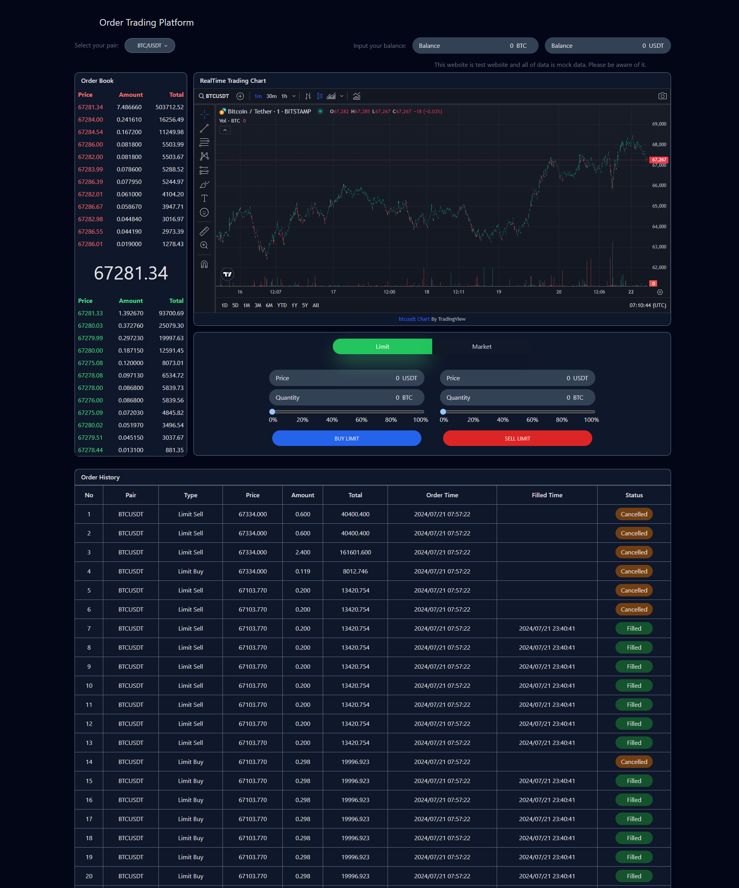

# Order Trading Platform



### Introduction

This project is order trading simulator for simulating user actions to buy and sell orders for various cryptocurrency pairs. It is built with React, TypeScript, Redux-toolkit, and Tailwind CSS. Powered by WebSocket Stream API from Binance, the platform can show real time market data and it has advanced chart functionality. The platform includes a real time order book, balance management, and order history.

### Features

- Shows real time market data for given cryptocurrency pairs.
- Shows real time order book with current price of pair.
- Manual balance management for cryptocurrency pairs.
- State management with Redux-toolkit
- Responsive design with Tailwind CSS.
- Real time notification with Server Sent Events

### Installation

1. Run the front-end project

```bash
cd order-balance-simulation-frontend
npm install
npm run dev
```

2. Run the back-end project

```bash
cd order-balance-simulation-backend
npm install
npm run dev
```

### Description

1. Front-end
   - Used React for building UI and implemented component oriented design.
   - Utilized Redux-toolkit for state management.
   - Used Binance WebSocket Stream API for fetching real-time data.
   - Utilized tailwindCSS to build the UI
   - Implemented the responsive design for wide-range devices with mobile-first oriented.
   - Used HTML5 Server Sent Event API for real time notification.

2. Back-end
   - Used MongoDB for storing order(fake action) histories.
   - Used indexing with MongoDB for reducing query execution time.
   - Used Express.js to implement the API endpoints.
   - Used Binance WebSocket Stream API for getting real-time price data.
   - Implemented Server Sent Event to push notifications efficiently.
   - Utilized RabbitMQ for improving reliability of data.

### Version

Node.js (22.3.0)

MongoDB(7.0)

